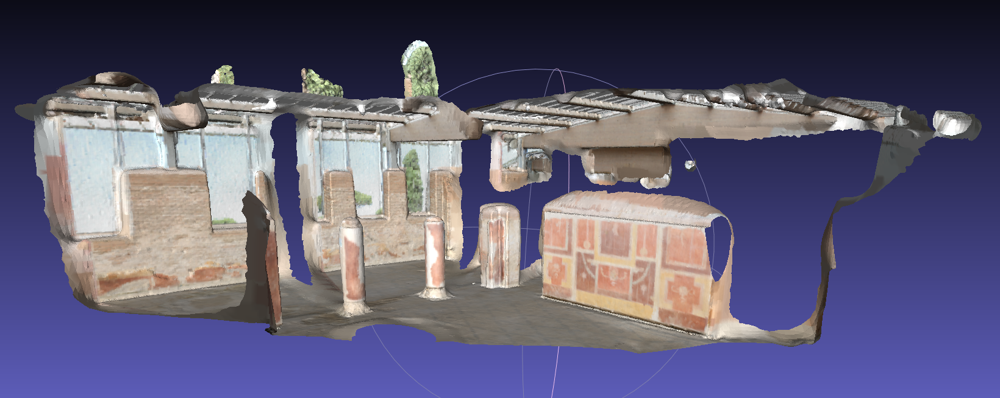

### Introduction

Surface reconstruction tool for 3DTK, is a program within 3DTK for reconstruction of trianglized mesh surfaces from 3D points data, with screened poisson surface reconstruction. It uses data sturctures and other tools that is provided with 3DTK, and add a poisson surface reconstruction.

Poisson surface reconstruction was introduced by [Michael Kazhdan](http://www.cs.jhu.edu/~misha/) et. al. in 2006, and was improved by their team several times after that. [Michael Kazhdan's implementation](http://www.cs.jhu.edu/~misha/Code/PoissonRecon/Version10.02/) of this algorithms has been widely used by many other softwares and tools like MeshLab and PCL, and is also under [maintainance](https://github.com/mkazhdan/PoissonRecon) by now. The reconstruction algorithm of my tool is also based on it.

The general workflow of the my tool is illustrated below.

[workflow chart](imgs/workflow.png)


---
### Sample usages

1. Use the default sample data under `dat/` directory. This sample data is composed of three scans, we join them first with `-j` tag, since it is relatively sparse and non-closed, we set a trimming value 7 with `-T` tag to trim extra part away. You can compare the model_all.obj and model_all_trimmed.obj to view the effects of trimming.
```shell
bin/recon dat dat/test/model -d 12 -T 7.0 -j
```


2. Use a common points data, for example the [Stanford Bunny](http://graphics.stanford.edu/data/3Dscanrep/#bunny). A recommended way is convert the original model file into .xyz file that only contains the xyz coordinates, rename it as `scan000.3d` and put it into a directory for example `dat/bunny/`, new a file called `scan000.pose` and put it under the same directory, and then use commands below. Unlike most scan data 3DTK is dealing with, the bunny surface is water-tight (closed), so we set the normal to be outward by adding a `-I` tag. For most scans data we use the default normal that are towards the scanner which we called inward.
```shell
bin/recon dat/bunny dat/bunny/model -I
```


3. Use [Thermobremen](http://kos.informatik.uni-osnabrueck.de/3Dscans/) data (No.22 on this page), a typical city scan data. This dataset is with file format uosr, we set it with `-f` tag. Since it is relatively large, we set an auto reduction with `-a` tag. We also set scans joining , poisson octree depth 12 and trimming value 9.0.
```shell
bin/recon dat/testdata/thermobremen dat/testdata/thermobremen/result -f uosr -a -j -d 12 -T 9
```


4. Use [Thermocolorlab](http://kos.informatik.uni-osnabrueck.de/3Dscans/) data (No.20 on this page), a typical indoor colored scan data. This dataset is with file format uos_rrgbt, so we set it with `-f` first. This scan range is extremly large, we are only going to reconstruct surface within one room here, so we filter part of it with `-u` tag, the filter range is -500 to 500 on x,y and z directions. We set scan number start from 0 and end with 12 with tag `-s` and `-e`, because other scans are not within the room we are going to show, so we just skip them for better speed and lower memory usages. We also set scan joing, octree depth and trimming value. To generate surface with color info, we have to use `-C` tag.
```shell
bin/recon dat/testdata/thermocolorlab/ dat/testdata/thermocolorlab/model -j -f uos_rrgbt -d 12 -T 8 -s 0 -e 12 -u "11;6;-500;500;-500;500;-500;500" -C
```


5. Use [Ostia]() data, another indoor colored scan data. Very similar to the Thermocolorlab data, this sample demonstrate that you could use only part of the scan by removing extra scans files. We first set file format to uos_rgb and use color as input data. Then set poisson octree depth 12 and trimming value 9.0.
```shell
bin/recon dat/testdata/ostia dat/testdata/ostia -j -f uos_rgb -d 12 -T 9 -C
```


6. Use [Randersacker](http://kos.informatik.uni-osnabrueck.de/3Dscans/) data (No.26 on this page), a typical natrual open scene data. For this kind of large dataset, certain kinds of reduction and filtering is needed before reconstruction. You can either use `--a` option like Thermobremen data above, or to manually set reduction parameters with `-r` option and `-O` options. To set a range filter, you can use `-u` tag. <br>
But sometimes for large dataset, reduction process will take a large number of time, finding an appropriate reduction parameters may take more time, so it is recommended that you use `bin/scan_red` program to reduce and filter scans first, then use the new files as data source for reconstruction. <br> 
Usages below use `scan_red` to reduce scans first, then use `recon` program to generate mesh surface. <br>
Scan data of objects like tree leaves are not exactly 'surface' but more like a 'volume', so the reconstruction of tree leaves might be noisy. This sample is more likely to be a demo.
```shell
bin/scan_red -s 0 -e 3 -f uosr --reduction OCTREE --voxel 20 --octree 10 dat/testdata/randersacker/
bin/recon dat/testdata/randersacker/reduced dat/testdata/randersacker/reduced/model -j -d 12 -T 9 -u "11;6;-1000;1000;-2000;2000;-1000;1000"
```


---
### Options list
##### I/O options
- **input-dir (mandatory)**, used without tag, the directory of input scans. <br> 
e.g. `dat/test`
- **output-dir**, used without tag, the output file name of models, if not set, models will be written to the input directory with names like model0_all.obj, model1_all.obj, ... (not joined) or model_all.obj and model_all_trimmed.obj (joined).  <br> 
e.g. `dat/test/model`
- **--format or -f**, specify format of input data, option value should be a string, if not set, the default format will be uos. Supported formats description could be found [here](http://slam6d.sourceforge.net/doc/fileformats.html). <br>
e.g. `-f uos_rgb`
- **--scanserver or -S**, set to use scanserver as input method, no option value needed. Basic scan will be used if this tag is not setted.<br> 
e.g. `-S`
- **--max or -M**, set to neglegt all data points with a distance larger than a certain value, option value should be an int number.<br> 
e.g. `-M 100`
- **--min or -m**, set to neglegt all data points with a distance smaller than a certain value, option value should be an int number.<br>
e.g. `-m 10`
- **--incolor or -C**, set to use color from points and generate colored mesh, no option value needed. By default no color will be used.<br>
e.g. `-C`
- **--nonormal or -N**, set to disable normal output into model file, no option value needed. By default normal will be output.<br>
e.g. `-N`

##### Reduction and filter options
- **--autored or -a**, set to use automatic reduction to reduce scan data, no option value needed. By default no reduction will be performed. Since automatic reduction might not fit all cases, set reduction parameters directly is a more recommended way. <br>
e.g. `-a`
- **--reduce or -r**, set to turns on octree based reduction, option value should be a double number represents the voxel size. This option should be used together with `--octree or -O` option. By default no octree based reduction will be performed. <br>
e.g. `-r 20`
- **--octree or -O**, set to use randomized octree based reduction, option value should be a int number represents the number of points per voxel. This option should be used together with `--reduce or -r` option. By default the value should be 1. <br>
e.g. `-O 10`
- **--customFilter or -u**, set to filter the scan data within a certain range, option value should be a string represents the filter parameters or a file that contains the filter parameters. By default no filter will be performed. <br>
e.g. `-u "11;6;-2000;2000;-2000;2000;-2000;2000"`

##### Scan related options
- **--join or -j**, set to join all scans before reduction, no options value needed. By default scans will be reconstructed individually. <br>
e.g. `-j`
- **--scale or -y**, set to apply a scaling factor to the original data, option value should be a double number. By default no scaling oprations will be performed. <br>
e.g. `-y`
- **--trustpose or -t**, set to use pose info instead of frame info for transformation, no option value needed. This option should be used when no frames info is provided with input scan data. By default the frames info will be used to perform transformation for each scan.<br> 
e.g. `-t`

##### Normal calculation options
(to be updated)

##### Poisson options
(to be updated)

---
### Commits
Commits can be viewed on Source Forge [commits list]((https://sourceforge.net/p/slam6d/code/commit_browser)). Most of my source codes and changes are within [include/mesh](https://sourceforge.net/p/slam6d/code/HEAD/tree/trunk/include/mesh/) and [src/mesh](https://sourceforge.net/p/slam6d/code/HEAD/tree/trunk/src/mesh/) directories.
- [[r1890]](https://sourceforge.net/p/slam6d/code/1890) mesh: fix bugs for color reading and transformation
- [[r1889]](https://sourceforge.net/p/slam6d/code/1889) mesh: reorganize source code file structures, fix bug for default PointWeight unset
- [[r1886]](https://sourceforge.net/p/slam6d/code/1886) mesh: improve auto reduce option and memory usages
- [[r1883]](https://sourceforge.net/p/slam6d/code/1883) mesh: add automatic scan reduction before reconstruction, fix some bugs with real data.
- [[r1880]](https://sourceforge.net/p/slam6d/code/1880) mesh: improve scan reduction in recon
- [[r1878]](https://sourceforge.net/p/slam6d/code/1878) mesh: Add options for input/output color data and output normal data
- [[r1877]](https://sourceforge.net/p/slam6d/code/1877) Apply SurfaceTrimmer with color to recon program
- [[r1875]](https://sourceforge.net/p/slam6d/code/1875) mesh: apply PoissonRecn with color to recon program
- [[r1874]](https://sourceforge.net/p/slam6d/code/1874) mesh: Add PoissonRecon with color support
- [[r1868]](https://sourceforge.net/p/slam6d/code/1868) normals: add flipNormal function and its usages in calc_normals program; mesh: add...
- [[r1859]](https://sourceforge.net/p/slam6d/code/1859) mesh: unify poisson related data structures and remove outdated codes
- [[r1855]](https://sourceforge.net/p/slam6d/code/1855) mesh: add surface trimmer to filter reconstructed mesh
- [[r1851]](https://sourceforge.net/p/slam6d/code/1851) mesh: try to rebuild
- [[r1850]](https://sourceforge.net/p/slam6d/code/1850) mesh: update poisson reconstruction with density calculation version
- [[r1846]](https://sourceforge.net/p/slam6d/code/1846) mesh: add model face filter based on its distance to the nearest point
- [[r1842]](https://sourceforge.net/p/slam6d/code/1842) mesh: remove cgal related codes to avoid building failures with cgal version problems
- [[r1841]](https://sourceforge.net/p/slam6d/code/1841) mesh: add some other testing approaches for normal estimation and surface reconstruction
- [[r1839]](https://sourceforge.net/p/slam6d/code/1839) Seperate recon program out of poisson, enable all normal calculation methods.
- [[r1829]](https://sourceforge.net/p/slam6d/code/1829) mesh: remove eigenlib from mesh dir, use system installed eigen instead
- [[r1828]](https://sourceforge.net/p/slam6d/code/1828) mesh: fix wrong face indices issue
- [[r1827]](https://sourceforge.net/p/slam6d/code/1827) mesh: add simple mesh smoothing based on vcglib, for testing purpose
- [[r1825]](https://sourceforge.net/p/slam6d/code/1825) mesh: let scans joining work before reconstruction
- [[r1823]](https://sourceforge.net/p/slam6d/code/1823) revert mischanging of CMakeLists
- [[r1822]](https://sourceforge.net/p/slam6d/code/1822) mesh: add options for joining scans before surface reconstruction (joining not finished)
- [[r1820]](https://sourceforge.net/p/slam6d/code/1820) mesh: apply poisson reconstruction to each scan individually
- [[r1818]](https://sourceforge.net/p/slam6d/code/1818) Add parameter options for poisson
- [[r1817]](https://sourceforge.net/p/slam6d/code/1817) Add parameters for normal estimation
- [[r1814]](https://sourceforge.net/p/slam6d/code/1814) mesh: remove outdated PoissonRecon dir
- [[r1813]](https://sourceforge.net/p/slam6d/code/1813) mesh: integrate scanio and calc_normals together with current poisson
- [[r1811]](https://sourceforge.net/p/slam6d/code/1811) mesh: add missing poisson.h
- [[r1810]](https://sourceforge.net/p/slam6d/code/1810) mesh: add sample scanio and calc_normals
- [[r1795]](https://sourceforge.net/p/slam6d/code/1795) Integrate KB's poisson reconstruction into src/mesh and add two sample test data
- [[r1793]](https://sourceforge.net/p/slam6d/code/1793) Update CMakeLists.txt to involve subdir 'src/mesh' in
- [[r1792]](https://sourceforge.net/p/slam6d/code/1792) Add mesh input, output and redering with sample data
