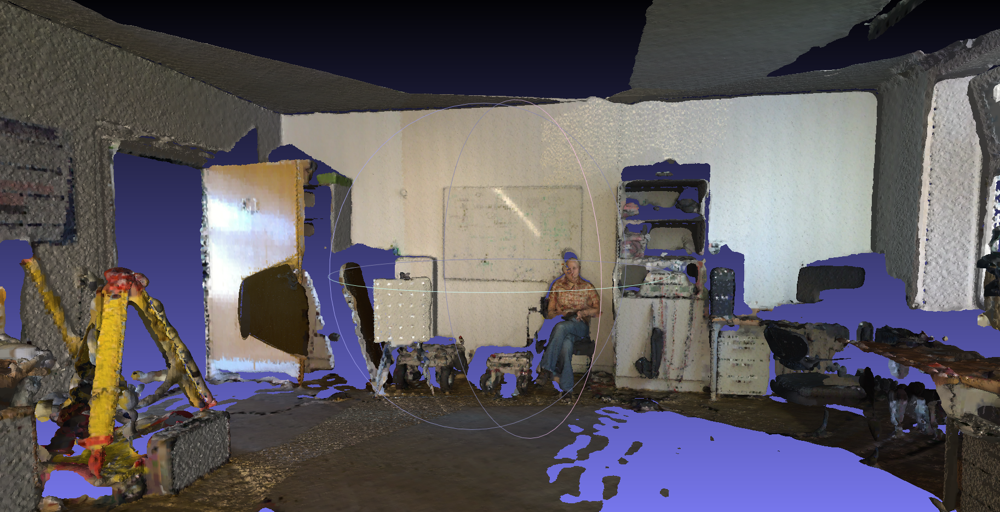

### Introduction

Surface reconstruction tool for 3DTK, is a program within 3DTK for reconstruction of trianglized mesh surfaces from 3D points data, with screened poisson surface reconstruction. It uses data sturctures and other tools that is provided with 3DTK, and add a poisson surface reconstruction.

Poisson surface reconstruction was introduced by [Michael Kazhdan](http://www.cs.jhu.edu/~misha/) et. al. in 2006, and was improved by their team several times after that. [Michael Kazhdan's implementation](http://www.cs.jhu.edu/~misha/Code/PoissonRecon/Version10.02/) of this algorithms has been widely used by many other softwares and tools like MeshLab and PCL, and is also under [maintainance](https://github.com/mkazhdan/PoissonRecon) by now. The reconstruction algorithm of my tool is also based on it.

The general workflow of the my tool is illustrated below.

[workflow chart](imgs/workflow.png)


### Sample usages

1. Use the default sample data under `dat/` directory, with all scans joining first, poisson octree depth 12 and trimming value 7.0.
```shell
bin/recon dat dat/test/model -t true -d 12 -T 7.0 -j true
```


2. Use a common points data, for example the [Stanford Bunny](http://graphics.stanford.edu/data/3Dscanrep/#bunny). A recommended way is convert the original model file into .xyz file that only contains the xyz coordinates, rename it as `scan000.3d` and put it into a directory for example `dat/bunny/`, new a file called `scan000.pose` and put it under the same directory, and then use commands below.
```shell
bin/recon dat/bunny dat/bunny/model --inward false
```


3. Use [Thermobremen](http://kos.informatik.uni-osnabrueck.de/3Dscans/)(No. 22 on this page) data, a typical city scan data, with file format uosr, auto reduction, scans joining, poisson octree depth 12 and trimming value 9.0.

```shell
bin/recon dat/testdata/thermobremen dat/testdata/thermobremen/result -f uosr -a true -j true -d 12 -T 9
```


4. (color bug fixing) Use [Thermocolorlab](http://kos.informatik.uni-osnabrueck.de/3Dscans/)(No. 20 on this page) data, a typical indoor scan data, with file format uos_rrgbt, scans joining, filter xyz range from -500 to 500, poisson octree depth 12 and trimming value 8.0.

```shell
bin/recon dat/testdata/thermocolorlab/ -j true -f uos_rrgbt -d 12 -T 8 -s 0 -e 12 -u "11;6;-500;500;-500;500;-500;500"
```


### Options list
##### Mandatory options
##### I/O options
##### Normal calculation options
##### Scan joining options
##### Poisson options

### Commits


