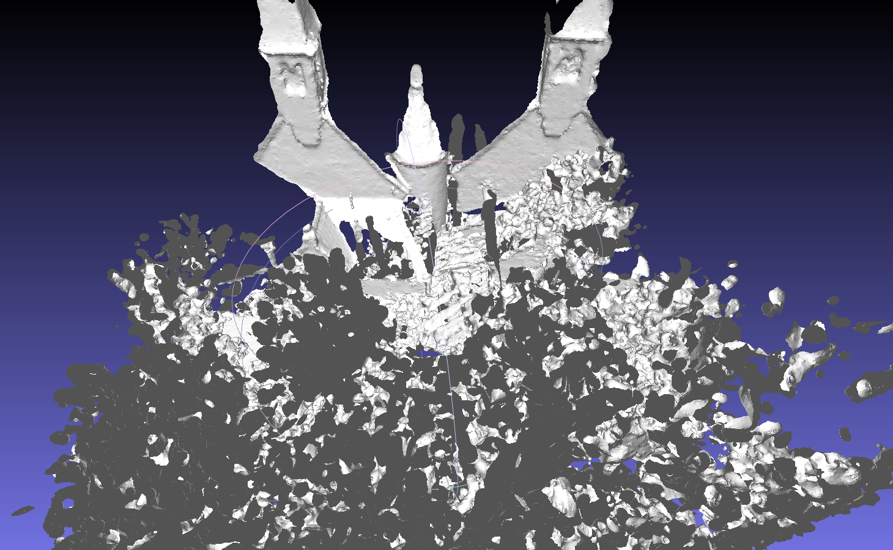

### Introduction

Surface reconstruction tool for 3DTK, is a program within 3DTK for reconstruction of trianglized mesh surfaces from 3D points data, with screened poisson surface reconstruction. It uses data sturctures and other tools that is provided with 3DTK, and add a poisson surface reconstruction.

Poisson surface reconstruction was introduced by [Michael Kazhdan](http://www.cs.jhu.edu/~misha/) et. al. in 2006, and was improved by their team several times after that. [Michael Kazhdan's implementation](http://www.cs.jhu.edu/~misha/Code/PoissonRecon/Version10.02/) of this algorithms has been widely used by many other softwares and tools like MeshLab and PCL, and is also under [maintainance](https://github.com/mkazhdan/PoissonRecon) by now. The reconstruction algorithm of my tool is also based on it.

The general workflow of the my tool is illustrated below.

[workflow chart](imgs/workflow.png)


### Sample usages

1. Use the default sample data under `dat/` directory, with all scans joining first, poisson octree depth 12 and trimming value 7.0.
```shell
bin/recon dat dat/test/model -t true -d 12 -T 7.0 -j true
```


2. Use a common points data, for example the [Stanford Bunny](http://graphics.stanford.edu/data/3Dscanrep/#bunny). A recommended way is convert the original model file into .xyz file that only contains the xyz coordinates, rename it as `scan000.3d` and put it into a directory for example `dat/bunny/`, new a file called `scan000.pose` and put it under the same directory, and then use commands below.
```shell
bin/recon dat/bunny dat/bunny/model --inward false
```


3. Use [Thermobremen](http://kos.informatik.uni-osnabrueck.de/3Dscans/) data (No.22 on this page), a typical city scan data, with file format uosr, auto reduction, scans joining, poisson octree depth 12 and trimming value 9.0.
```shell
bin/recon dat/testdata/thermobremen dat/testdata/thermobremen/result -f uosr -a true -j true -d 12 -T 9
```


4. Use [Thermocolorlab](http://kos.informatik.uni-osnabrueck.de/3Dscans/) data (No.20 on this page), a typical indoor scan data, with file format uos_rrgbt, scans joining, color as input data, filter xyz range from -500 to 500, poisson octree depth 12 and trimming value 8.0. In this sample a range filter is setted since the while scene is too large.
```shell
bin/recon dat/testdata/thermocolorlab/ dat/testdata/thermocolorlab/model -j true -f uos_rrgbt -d 12 -T 8 -s 0 -e 12 -u "11;6;-500;500;-500;500;-500;500" --incolor true
```


5. Use [Randersacker](http://kos.informatik.uni-osnabrueck.de/3Dscans/) data (No.26 on this page), a typical natrual open scene data. For this kind of large dataset, certain kinds of reduction is needed before reconstruction. You can either use `--autored` option like Thermobremen data above, or to manually set reduction parameters with `--reduce` option and `--octree` options. Sometimes for large dataset, reduction process will take a large number of time, finding an appropriate reduction parameters may take more time, so it is recommended that you use `bin/scan_red` program to reduce scans first, then use the new files as data source for reconstruction. <br> 
Usages below use `scan_red` to reduce scans first, then use `recon` program to generate mesh surface. <br>
Scan data of objects like tree leaves are not exactly a 'surface' but more like a 'volume', so the reconstruction of tree leaves might not be good. This sample is more likely to be a demo.
```shell
bin/scan_red -s 0 -e 3 -f uosr --reduction OCTREE --voxel 20 --octree 10 dat/testdata/randersacker/
bin/recon dat/testdata/randersacker/reduced dat/testdata/randersacker/reduced/model -j true -d 12 -T 9 -u "11;6;-1000;1000;-1000;1000;-1000;1000"
```


6. Use [Bräutigam](http://kos.informatik.uni-osnabrueck.de/3Dscans/) data (No.19 on this page), a typical unstructured environment data with color.

### Options list
##### Mandatory options
##### I/O options
##### Normal calculation options
##### Scan joining options
##### Poisson options

### Commits
Commits can be viewed on Source Forge [commits list]((https://sourceforge.net/p/slam6d/code/commit_browser)). Most of my source codes and changes are within [include/mesh](https://sourceforge.net/p/slam6d/code/HEAD/tree/trunk/include/mesh/) and [src/mesh](https://sourceforge.net/p/slam6d/code/HEAD/tree/trunk/src/mesh/) directories.
- [[r1890]](https://sourceforge.net/p/slam6d/code/1890) mesh: fix bugs for color reading and transformation
- [[r1889]](https://sourceforge.net/p/slam6d/code/1889) mesh: reorganize source code file structures, fix bug for default PointWeight unset
- [[r1886]](https://sourceforge.net/p/slam6d/code/1886) mesh: improve auto reduce option and memory usages
- [[r1883]](https://sourceforge.net/p/slam6d/code/1883) mesh: add automatic scan reduction before reconstruction, fix some bugs with real data.
- [[r1880]](https://sourceforge.net/p/slam6d/code/1880) mesh: improve scan reduction in recon
- [[r1878]](https://sourceforge.net/p/slam6d/code/1878) mesh: Add options for input/output color data and output normal data
- [[r1877]](https://sourceforge.net/p/slam6d/code/1877) Apply SurfaceTrimmer with color to recon program
- [[r1875]](https://sourceforge.net/p/slam6d/code/1875) mesh: apply PoissonRecn with color to recon program
- [[r1874]](https://sourceforge.net/p/slam6d/code/1874) mesh: Add PoissonRecon with color support
- [[r1868]](https://sourceforge.net/p/slam6d/code/1868) normals: add flipNormal function and its usages in calc_normals program; mesh: add...
- [[r1859]](https://sourceforge.net/p/slam6d/code/1859) mesh: unify poisson related data structures and remove outdated codes
- [[r1855]](https://sourceforge.net/p/slam6d/code/1855) mesh: add surface trimmer to filter reconstructed mesh
- [[r1851]](https://sourceforge.net/p/slam6d/code/1851) mesh: try to rebuild
- [[r1850]](https://sourceforge.net/p/slam6d/code/1850) mesh: update poisson reconstruction with density calculation version
- [[r1846]](https://sourceforge.net/p/slam6d/code/1846) mesh: add model face filter based on its distance to the nearest point
- [[r1842]](https://sourceforge.net/p/slam6d/code/1842) mesh: remove cgal related codes to avoid building failures with cgal version problems
- [[r1841]](https://sourceforge.net/p/slam6d/code/1841) mesh: add some other testing approaches for normal estimation and surface reconstruction
- [[r1839]](https://sourceforge.net/p/slam6d/code/1839) Seperate recon program out of poisson, enable all normal calculation methods.
- [[r1829]](https://sourceforge.net/p/slam6d/code/1829) mesh: remove eigenlib from mesh dir, use system installed eigen instead
- [[r1828]](https://sourceforge.net/p/slam6d/code/1828) mesh: fix wrong face indices issue
- [[r1827]](https://sourceforge.net/p/slam6d/code/1827) mesh: add simple mesh smoothing based on vcglib, for testing purpose
- [[r1825]](https://sourceforge.net/p/slam6d/code/1825) mesh: let scans joining work before reconstruction
- [[r1823]](https://sourceforge.net/p/slam6d/code/1823) revert mischanging of CMakeLists
- [[r1822]](https://sourceforge.net/p/slam6d/code/1822) mesh: add options for joining scans before surface reconstruction (joining not finished)
- [[r1820]](https://sourceforge.net/p/slam6d/code/1820) mesh: apply poisson reconstruction to each scan individually
- [[r1818]](https://sourceforge.net/p/slam6d/code/1818) Add parameter options for poisson
- [[r1817]](https://sourceforge.net/p/slam6d/code/1817) Add parameters for normal estimation
- [[r1814]](https://sourceforge.net/p/slam6d/code/1814) mesh: remove outdated PoissonRecon dir
- [[r1813]](https://sourceforge.net/p/slam6d/code/1813) mesh: integrate scanio and calc_normals together with current poisson
- [[r1811]](https://sourceforge.net/p/slam6d/code/1811) mesh: add missing poisson.h
- [[r1810]](https://sourceforge.net/p/slam6d/code/1810) mesh: add sample scanio and calc_normals
- [[r1795]](https://sourceforge.net/p/slam6d/code/1795) Integrate KB's poisson reconstruction into src/mesh and add two sample test data
- [[r1793]](https://sourceforge.net/p/slam6d/code/1793) Update CMakeLists.txt to involve subdir 'src/mesh' in
- [[r1792]](https://sourceforge.net/p/slam6d/code/1792) Add mesh input, output and redering with sample data
